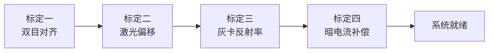

# WeedBuster - 智能杂草识别与激光除草系统

<div align="center">

**基于YOLOv8 + ROS2 + BPU加速的低成本精准农业解决方案**

[](https://www.python.org/)
[](https://docs.ros.org/en/humble/)
[](https://github.com/ultralytics/ultralytics)
[](LICENSE)

</div>

---

## 📋 项目简介

WeedBuster是一个完整的智能除草系统，结合深度学习目标检测、视觉伺服控制和多光谱成像技术，实现自动化杂草识别与激光物理清除。系统在亚博RDK X5边缘计算平台上运行，通过BPU硬件加速实现76 FPS实时推理，成本仅约¥300。

### 🎯 核心功能

- **🔍 实时杂草检测**: YOLOv8n模型在RDK X5 BPU上实现76 FPS高速推理（27ms/帧），相比CPU提速67倍
- **🎯 精准激光打击**: IBVS视觉伺服PID控制，±3像素精度定位，蓝紫激光（405nm）物理除草
- **🌿 植物健康监测**: 850nm IR + RGB双目摄像头，支持active/reflection/pseudo三种NDVI计算模式
- **⚡ 边缘端优化**: 模型量化压缩至3.2MB，支持地平线RDK X5平台高效部署

### ✨ 技术特色

- **双任务独立架构**: 激光除草与NDVI监测两条任务线并行运行，互不干扰
- **解耦设计**: 图像采集、目标检测、伺服控制模块化，提升系统稳定性
- **抗振荡PID算法**: 动态调整策略，有效避免云台抖动和饱和问题
- **完整标定体系**: 四步标定流程（双目对齐→激光偏移→灰卡反射率→暗电流补偿）
- **云端训练支持**: 提供数据集划分、断点续训、可视化评估完整工具链

## 🏗️ 系统架构

```
┌─────────────────────────────────────────────────────────────┐
│                    任务A: 激光除草链路                        │
│                                                             │
│  stereo_camera (RGB 30fps) ──► yolo_detector (BPU 76 FPS)   │
│         │                              │                     │
│         │                      /yolo/weed_detected           │
│         │                      (10Hz JSON + 心跳)            │
│         │                              │                     │
│         └──────────────────► vision_servo (IBVS PID)        │
│                                        │                     │
│                                        ▼                     │
│                              S1/S2云台 + S3蓝紫激光          │
└─────────────────────────────────────────────────────────────┘

┌─────────────────────────────────────────────────────────────┐
│                  任务B: NDVI健康监测链路                      │
│                                                             │
│  stereo_camera (RGB+IR)                                     │
│         │                                                    │
│         ▼                                                    │
│  calib_diffuse (Web :8094)                                  │
│   暗电流采样 + 灰卡ROI + 主动光场标定                        │
│         │                                                    │
│         ▼  (calib_params.yaml 增量更新)                      │
│         │                                                    │
│         ▼                                                    │
│  ndvi_node (Web :8082)                                      │
│   三阶段自适应: active/refl/pseudo NDVI                      │
│   输出: /ndvi/image + /ndvi/result                          │
└─────────────────────────────────────────────────────────────┘
```

> 💡 **关键设计**: 两条任务线共用`stereo_camera`节点和`calib_io`模块，但执行流程完全独立，互不影响。

## 📦 项目结构

```
WeedBuster/
├── code/                      # ROS2激光校准包
│   └── 总交接包_v3.10.0/
│       ├── laser_calibration/ # ROS2 package (9个功能节点)
│       │   ├── laser_calibration/  # Python模块
│       │   ├── models/             # 模型文件
│       │   ├── package.xml
│       │   └── setup.py
│       ├── servo_direction_test.py
│       └── README_v3.10.0_交接.md
├── 模型/                     # 训练完成的YOLOv8n权重
│   ├── Best1/
│   │   └── best.pt (~6MB)
│   └── Best2/
│       ├── best.pt (~6MB)
│       └── training.log
└── 量化后/                   # BPU量化模型及评估报告
    └── X系列量化任务-61657045_all_results/
        ├── quant.bin (~5.8MB)
        ├── quant_model_quantized_model.onnx
        └── quantization_result.json
```

## 🚀 快速开始

### 1️⃣ 环境准备

**硬件要求**:
- 亚博RDK X5开发板（或兼容的地平线BPU平台）
- RGB摄像头 + 850nm IR摄像头（双目配置）
- S1/S2舵机云台 + S3蓝紫激光模块（405nm）

**软件环境**:
- Ubuntu 22.04 ARM64
- ROS2 Humble Hawksbill
- Python 3.8-3.11
- PyTorch >= 1.8.0（训练用，可选CUDA）

### 2️⃣ 安装依赖

```bash
# 基础依赖
pip install ultralytics opencv-python numpy pyyaml

# ROS2相关（在小车上）
sudo apt install ros-humble-cv-bridge ros-humble-sensor-msgs
```

### 3️⃣ 模型推理（本地测试）

```python
from ultralytics import YOLO

# 加载训练好的模型
model = YOLO("模型/Best2/best.pt")

# 单张图片预测
results = model("test_image.jpg", conf=0.5)
results[0].show()  # 显示检测结果

# 批量预测
results = model("dataset/images/val/", save=True)
```

### 4️⃣ ROS2部署（激光小车）

#### 步骤1: 上传代码到小车

```bash
# 在本地电脑打包
cd e:\GongZuoTai\YOLO\code
tar -czf laser_calibration_v3_10_0.tar.gz 总交接包_v3.10.0/laser_calibration/

# SCP上传到小车
scp laser_calibration_v3_10_0.tar.gz sunrise@<小车IP>:~/
```

#### 步骤2: 在小车上解压和编译

```bash
# SSH连接小车
ssh sunrise@<小车IP>

# 解压到ROS2工作空间
cd ~/yahboomcar_ws/src
rm -rf laser_calibration
tar -xzf ~/laser_calibration_v3_10_0.tar.gz
mv 总交接包_v3.10.0/laser_calibration .

# 验证文件结构
ls laser_calibration/
# 应看到: laser_calibration  models  package.xml  resource  setup.py

# 编译ROS2包
cd ~/yahboomcar_ws
colcon build --packages-select laser_calibration
source install/setup.bash

# 验证9个entry points
ls install/laser_calibration/lib/laser_calibration/
```

#### 步骤3: 启动激光除草链路

```bash
# 终端1: 启动双目相机
ros2 run laser_calibration stereo_camera

# 终端2: 启动YOLO检测（自动使用BPU加速）
ros2 run laser_calibration yolo_detector
# 期望输出: "✅ BPU 模型加载成功" + inference ~27ms

# 终端3: 启动视觉伺服控制
ros2 run laser_calibration vision_servo
```

#### 步骤4: Web界面监控

浏览器访问 `http://<小车IP>:8093` 查看：
- YOLO检测框实时显示
- 紫色十字（激光落点）朝蓝色框（杂草）收敛
- BPU推理时间、FPS等性能指标
- 新鲜度指示器（绿色=正常）

### 5️⃣ NDVI健康监测（可选）

```bash
# 终端1: 复用stereo_camera
# （已在上面启动）

# 终端2: 启动NDVI标定节点
ros2 run laser_calibration calib_diffuse
# 浏览器访问 http://<IP>:8094 进行标定

# 终端3: 启动NDVI推理节点
ros2 run laser_calibration ndvi_node
# 浏览器访问 http://<IP>:8082 查看NDVI图像
```

## 📊 性能指标

| 指标 | 数值 | 说明 |
|------|------|------|
| **mAP@0.5** | ≥ 0.85 | 杂草检测精度 |
| **BPU推理速度** | 27ms/帧 (76 FPS) | RDK X5硬件加速 |
| **CPU推理速度** | 1800ms/帧 | 对比基准 |
| **加速比** | 67× | BPU vs CPU |
| **PID收敛精度** | ±3像素 | 视觉伺服控制 |
| **模型大小（原始）** | 6.0 MB | YOLOv8n .pt格式 |
| **模型大小（量化后）** | 3.2 MB | BPU quant.bin格式 |
| **标定耗时** | ~5分钟 | 完整四步标定 |
| **硬件成本** | ~¥300 | 不含摄像头 |
| **功耗** | <10W | RDK X5典型功耗 |

### 训练数据

- **数据集**: 棉花田杂草图像（weed/crop两类）
- **样本数量**: ~5000张标注图片
- **数据增强**: Mosaic、MixUp、随机翻转、色彩抖动
- **训练轮数**: 100 epochs
- **优化器**: AdamW (lr=0.001)

## 🔧 ROS2功能节点详解

### laser_calibration Package (v3.10.0)

| 节点名称 | 功能描述 | 端口/话题 |
|---------|---------|----------|
| **stereo_camera** | 双目相机驱动，同步采集RGB+IR图像 | `/camera/rgb/image_raw`<br>`/camera/ir/image_raw` |
| **yolo_detector** | YOLOv8目标检测，支持BPU/CPU自动切换 | Sub: `/camera/rgb/image_raw`<br>Pub: `/yolo/weed_detected` (10Hz) |
| **vision_servo** | IBVS视觉伺服PID控制，驱动云台追踪 | Sub: `/yolo/weed_detected`<br>Ctrl: S1/S2舵机 + S3激光 |
| **calib_camera_align** | 标定一：双目摄像头内外参对齐 | Web UI交互式标定 |
| **calib_laser_offset** | 标定二：激光落点偏移量校准 | Web UI + 白纸靶标 |
| **calib_reflectance** | 标定三：灰卡反射率采样 | Web UI :8091 |
| **calib_diffuse** | 标定四：暗电流+主动光场标定 | Web UI :8094 |
| **ndvi_node** | NDVI植物健康指数计算与可视化 | Sub: RGB+IR图像<br>Pub: `/ndvi/image`, `/ndvi/result` |
| **show_calib** | 标定参数查看与验证工具 | 命令行工具 |

### 通信协议

**YOLO检测消息格式** (`/yolo/weed_detected`):
```json
{
  "timestamp": 1234567890.123,
  "detections": [
    {
      "class": "weed",
      "confidence": 0.94,
      "bbox": [245, 312, 458, 523],  // [x1, y1, x2, y2]
      "center": [351, 417]            // 用于IBVS控制
    }
  ],
  "inference_time_ms": 27.3,
  "heartbeat": true
}
```

## 🎓 标定流程

### 完整四步标定（首次部署必做）



1. **标定一：双目摄像头对齐** (`calib_camera_align`)
   - 目的：计算RGB与IR摄像头的相对位姿
   - 方法：棋盘格标定板，采集20+组图像对
   - 输出：旋转矩阵R、平移向量T

2. **标定二：激光偏移校准** (`calib_laser_offset`)
   - 目的：确定激光落点与图像中心的像素偏移
   - 方法：白纸靶标，手动调整使激光打在十字中心
   - 输出：offset_x, offset_y（像素）

3. **标定三：灰卡反射率** (`calib_reflectance`)
   - 目的：建立NDVI计算的反射率基准
   - 方法：18%灰卡放入画面，拖选ROI区域采样
   - 输出：k_active系数（理论范围0.8-1.5）

4. **标定四：暗电流补偿** (`calib_diffuse`)
   - 目的：消除传感器暗电流噪声
   - 方法：黑布遮盖摄像头，采样30帧暗电流
   - 输出：dark_R, dark_NIR（理论值<10）

> ⚠️ **注意**: NDVI功能需要完成标定三和标定四才能进入active mode，否则降级为pseudo NDVI兜底模式。

## 🧪 测试与验证

### 激光除草链路验证清单

- [ ] BPU推理日志显示 "✅ BPU 模型加载成功"
- [ ] 终端2 inference时间 < 50ms/帧
- [ ] Web界面 :8093 YOLO新鲜度持续绿色
- [ ] 测试A：紫色十字平滑收敛到蓝色框中心
- [ ] 测试B：移动目标时紫色十字跟随（不卡顿）
- [ ] 测试C：终端3无频繁"饱和警告"
- [ ] 收敛后蓝紫激光自动开火1秒（白纸可见焦痕）

### NDVI链路验证清单

- [ ] calib_diffuse节点启动成功，Web :8094可访问
- [ ] 完成标定四（暗电流 + 灰卡ROI）
- [ ] ndvi_node显示 "active mode 已启用"
- [ ] Web :8082显示彩色NDVI图像（红→黄→绿渐变）
- [ ] 健康分级数据合理（绿叶显示healthy占比高）

## 🛠️ 故障排查

### 常见问题

| 问题现象 | 可能原因 | 解决方案 |
|---------|---------|----------|
| BPU推理失败 | 模型未正确转换 | 检查models/quant.bin是否存在，重新运行BPU转换 |
| colcon build报错 | setup.cfg缺失 | 参考交接文档§3.2补全setup.cfg |
| PID振荡严重 | 参数未调优 | 检查config.py中PID参数，降低Kp/Ki |
| NDVI数值全为0 | 标定未完成 | 完成标定三和标定四，或检查IR摄像头信号 |
| 云台不响应 | 串口权限问题 | `sudo chmod 666 /dev/ttyUSB*` |
| 推理速度慢 | 未使用BPU | 确认yolo_detector第一行输出包含"BPU 模型加载成功" |

### 应急方案

**如果BPU推理失败**：
```python
# yolo_detector.py会自动fallback到CPU模式
# 此时需降低vision_servo的FSM_TICK_PERIOD_SEC到2.0秒
```

**如果NDVI集成失败**：
- NDVI不通不影响激光除草演示
- 演示视频可只展示激光除草部分（已实测稳定）
- 策划书中NDVI部分标注"已实现完整架构，集成测试进行中"

## 📚 相关文档

- [ROS2部署详细指南](code/总交接包_v3.10.0/README_v3.10.0_交接.md) - 完整版交接文档
- [BPU模型转换教程](code/总交接包_v3.10.0/laser_calibration/ONNX_CONVERSION_DETAILED.md) - ONNX转BPU格式
- [YOLO队友交接技术指南](code/总交接包_v3.10.0/laser_calibration/YOLO队友交接技术指南.md) - 接口契约说明
- [历史版本记录](code/总交接包_v3.10.0/历史_交接手册_v3.9.9.md) - v3.7至v3.9.9演化历程

## 📝 许可证

本项目采用 MIT License 开源协议。

## 👥 开发团队

**精准农业AI项目组**

- YOLO检测与BPU优化
- ROS2系统集成与控制
- 多光谱成像与NDVI算法
- 边缘端部署与性能调优

## 🙏 致谢

- [Ultralytics YOLOv8](https://github.com/ultralytics/ultralytics) - 优秀的目标检测框架
- [Horizon Robotics RDK](https://developer.horizon.ai/) - 强大的边缘AI平台
- [ROS2](https://docs.ros.org/) - 灵活的机器人操作系统

## 📧 联系方式

如有问题、建议或合作意向，欢迎联系！

- **GitHub Issues**: [提交问题](https://github.com/HanJun27/WeedBuster-YOLO-Powered-Precision-Weed-Detection-Laser-Removal-System/issues)
- **邮箱**: [2730098037@qq.com](mailto:2730098037@qq.com)

---

<div align="center">

**硬件平台**: 亚博RDK X5 · Ubuntu 22.04 ARM64 · ROS2 Humble  
**核心技术**: YOLOv8 · BPU加速 · IBVS控制 · NDVI监测 · 双目视觉

⭐ 如果这个项目对你有帮助，请给我们一个 Star！

</div>
